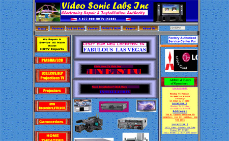

This is my very own personal website. I tried to make it 90's themed. The date is exactly 27 years off. I hope you enjoy getting to learn a little bit about me!
NOTE - The images may take a while to load.

### How I made this project:
- I started by collecting different design elements from the internet. Some of these include fake ads (like near the bottom) and the background, which is from the Windows 95 website. If you are wanting to create a similarly designed website, you should check out [the advertisement archive](https://www.banner-depot-2000.net/), as well as visit vintage websites on the Internet Archive.
- Next, I compiled all of these elements for a basic layout on every page, and then chose a color scheme. I wanted a bold color scheme that reminded me of something you would see in the 90's.

Here is an example: 

- All of the images that I put together are ones that I took in the past 5-or so years around North America. Anyone can use them if you would like under CC0! 
- Finally, I filled in all of my personal information and stuff I wanted to put in the website. It's done!
- This website is hosted on one of my projects for school. I am using a VPS through cloudflare. The domain was only $0.98, and the VPS is around 12 dollars a month. Not bad!

AI Use - Debug for Photo Gallery and border
